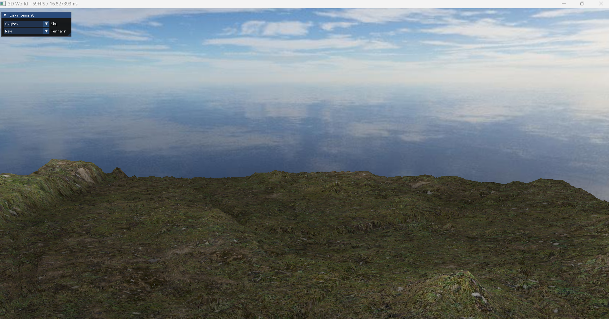

# 3D World

This project serves as a comprehensive introduction to 3D graphics programming using OpenGL. It focuses on rendering a fully interactive 3D world, providing users the ability to visualize, manipulate, and explore various elements such as models, terrains, and environmental effects. The project leverages modern OpenGL techniques to handle real-time rendering, efficient resource management, and user interaction.



## Overview

This project is an educational platform for learning core 3D graphics concepts using OpenGL. It teaches users how to:

- Load and display 3D models.
- Modify environments like skies and terrains.
- Perform basic object transformations (move, rotate, scale).
- Apply key rendering techniques like lighting and texturing.

The project is still in development, with ongoing improvements and new features.

## Dependencies

To build and run the project, the following libraries are required:

- GLFW: A library for creating windows, handling input, and managing OpenGL contexts.
- GLAD: A library that loads OpenGL function pointers, ensuring compatibility with different OpenGL versions.
- GLM: OpenGL Mathematics Library used for efficient vector and matrix operations required for 3D transformations.
- imgui: A user-friendly GUI framework for OpenGL that allows users to interact with the application through graphical controls.
- Assimp: An open-source library for importing and exporting 3D models in various file formats.

## Building the Project
Follow these steps to build the project:

1. Navigate to the project directory
2. Create a build directory
```bash
    mkdir build
    cd build
```
3. Run CMake to configure the project: 
```bash
   cmake ..
```
4. Build the project
```bash
   cmake --build .
```

## Future Improvements
This project is still under active development, with several key features planned for future releases:

## Contributing
Contributions are welcome! If you have ideas for new features or improvements, feel free to submit a pull request or open an issue on GitHub.

## License
This project is licensed under the GNU License. See the LICENSE file for more details.
