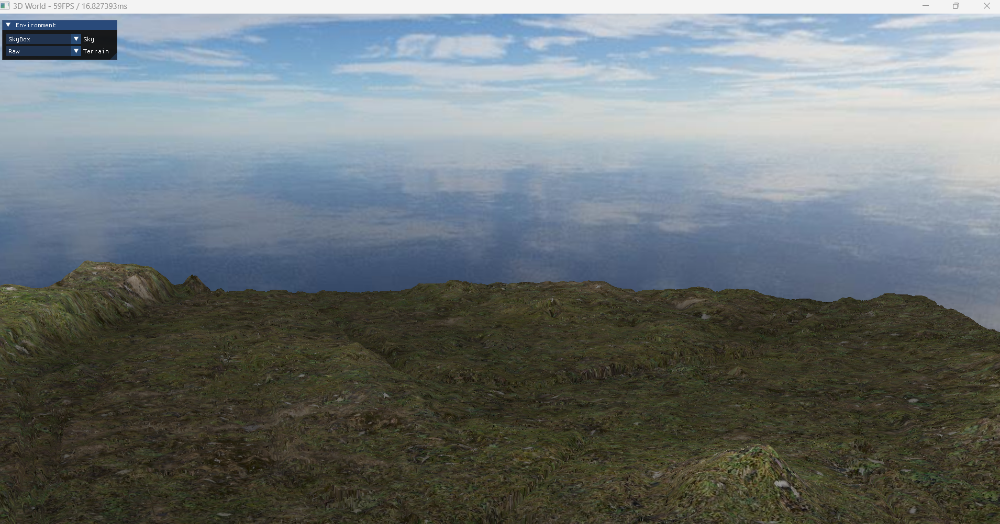

# 3D World

This project is designed to visualize 3D world and perform various manipulations on the models using OpenGL.

## Prerequisites

Before getting started with this project, ensure that you have the following necessary libraries installed:

- [GLFW](https://www.glfw.org/): A library for creating windows with OpenGL contexts.
- [GLAD](https://github.com/Dav1dde/glad): A library for loading OpenGL function pointers.
- [GLM](https://glm.g-truc.net/0.9.9/index.html): The OpenGL Mathematics library for vector and matrix math.
- [Assimp](https://www.assimp.org/): An Open Asset Import Library for loading 3D models.

These libraries are essential for enabling the functionality of the 3D World project. Be sure to install them before proceeding.
